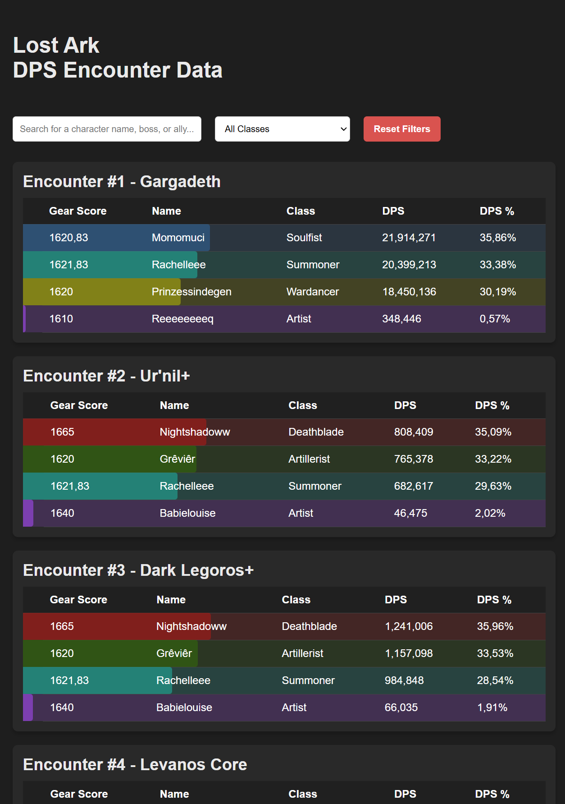
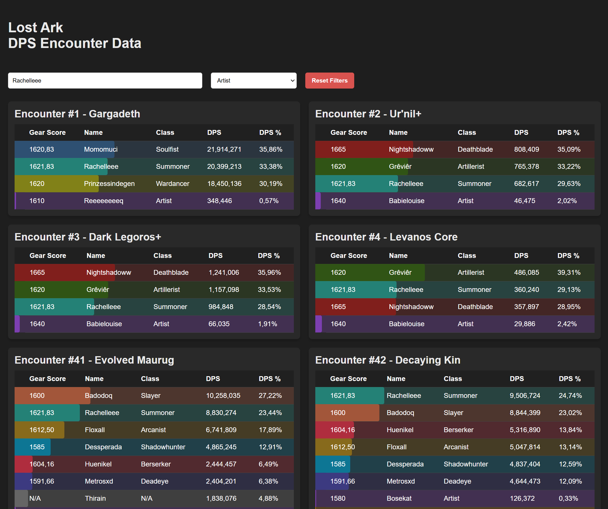

# Assignment Dev V : Rachelle van Uden

## Project Description

This project visualizes DPS (Damage Per Second) data collected from Lost Ark encounters. The application enables players to analyze their performance, evaluate skill usage, and optimize efficiency. By providing a user-friendly interface for exploring encounter data, this tool empowers players to improve their gameplay by reflecting on their contributions during battles and gaining insights into team and individuals.

## Key Features

- Visual representation of DPS data per encounter, with customizable filtering options.
- Search functionality to find encounters by character, boss, or ally names.
- Class filtering with a dropdown menu to focus on specific class performance.
- A responsive, dark-mode-friendly user interface for improved usability.
- Reset filter functionality to clear search inputs and restore default views.

## Project Structure

- **`src/`** - Application code (components, services)
  - **`backend/`** - Backend logic, including API endpoints and database interactions.
  - **`frontend/`** - React-based frontend for displaying visualizations.
- **`public/`** - Static files such as images.
- **`docs/`** - Documentation including progress reports, technical decisions, and design notes.

## Getting Started

To run the project locally, follow these steps:

**Clone the repository**:<br>
git clone https://github.com/EHB-MCT/assignment-2-RachellevanUden.git

**Navigate to the project directory**: <br>
`cd assignment-2-RachellevanUden`

**Install dependencies for both frontend and backend**:

- Frontend (React + Vite):<br>
  `cd src/frontend`<br>
  `npm install`

- Backend (Express + Nodemon):<br>
  `cd ../../src/backend`<br>
  `npm install`

**Configure MongoDB**

1. Create a MongoDB Atlas cluster or connect to an existing one.
2. Update the connection string in `src/backend/db/mongo.js`: <br>
   `const connectionString = 'your-mongodb-connection-string';`
3. Ensure your database includes a collection named `encounters`.

**Start the project (runs both frontend and backend simultaneously)**:<br>
`cd ../..`<br>
`npm run dev`

This will run:

- **Frontend** on `http://localhost:5174` <br>
- **Backend** on `http://localhost:3000`

## Using the Database

**Adding Data** <br>
You can manually add data to the MongoDB database:

1. Use the MongoDB Compass GUI or a MongoDB shell.
2. Insert documents into the `encounters` collection with the following schema:

```json
{
	"name": "Character Name",
	"encounterId": 1234,
	"className": "Class Name",
	"gearScore": 1600,
	"dps": 50000
}
```

**Accessing Data** <br>
Data can be accessed via the `/api/encounters` endpoint:

1. Use Postman or a browser to perform a GET request:
   `GET http://localhost:3000/api/encounters`
2. The response will include all encounter data in JSON format.

## Available Scripts

**`npm run dev`**: Start both the frontend and backend simultaneously. <br>
**`npm run dev:frontend`**: Start the frontend (Vite). <br>
**`npm run dev:backend`**: Start the backend (with Nodemon).

## Project Dependencies

- **Frontend**:
  - React, React-DOM
  - Vite (for bundling and development)
  - ESLint (for linting)
- **Backend**:
  - Express (for the API)
  - Nodemon (for live reloading during development)
  - Mongoose (for MongoDB interactions)

## Folder Structure

Here’s a breakdown of the main folders:

**`src/`**: Contains all the source code, split into frontend and backend. <br>
**`public/`**: Contains static files served directly to the user. <br>
**`docs/`**: Contains documentation related to the project.<br>
**`config/`**: Contains configuration files like ESLint, Vite, etc.

## API Endpoints

### `/api/encounters`

- **Method**: GET
- **Description**: Returns encounter data including character names, classes, gear score, and DPS.
- **Response Format**: JSON

#### **Response Example**:

```json
[
	{
		"name": "Behemoth, Cruel Storm Slayer",
		"encounterId": 1056,
		"className": "",
		"gearScore": 0,
		"dps": 0
	},
	{
		"name": "Purefocus",
		"encounterId": 1056,
		"className": "Slayer",
		"gearScore": 1680,
		"dps": 127731184
	}
]
```

#### **Status Codes:**

**200 OK:** Data retrieved successfully. <br>
**500 Internal Server Error:** There is a problem with the server or database.

### `/api/encounters (POST)`

- **Method:** POST
- **Description:** Adds new encounter data to the database.
- **Request Body Format:** JSON
- **Response:** Returns the saved encounter document.

#### **Example Request Body:**

```json
{
	"name": "Breakerge",
	"encounterId": 1234,
	"className": "Breaker",
	"gearScore": 1640,
	"dps": 500000
}
```

#### **Example Response:**

```json
{
	"_id": "1234567890abcdef",
	"name": "Breakerge",
	"encounterId": 1234,
	"className": "Breaker",
	"gearScore": 1640,
	"dps": 500000
}
```

#### **Data Migration (SQLite to MongoDB)**

Previously, this project used a local SQLite database (`encounters.db`). A one-time migration was performed to transfer data to MongoDB using a custom script (`migrateData.js`). This script has been removed as it is no longer necessary.

## Gitignore

The project uses a **`.gitignore`** file to exclude unnecessary files from version control, such as **`node_modules`**, build directories, and IDE settings.<br>

Here is an overview of the ignored files:<br>

**`node_modules/`**: Automatically generated by npm, contains installed dependencies.<br>
**`dist/`**: Build files generated during the development process.<br>
IDE-specific files: **`.vscode/`**, **`.idea/`**, etc.

## Screenshots

#### Dashboard View



#### Search and Filter


